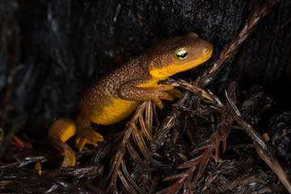

<br>
  

####Newt likelihood survey for tail damage
SVL is snout-to-vent (SVL) in mm.
Net survey, random sweeps, Taricha torosa v Taricha granulosa) and whether their tails had been nibbled off (y/n).

###EDA
```{r, warning=FALSE, message=FALSE}
library(tidyverse)
data <- read_csv("data/max.newt.2017.csv")
data
data <- data %>% mutate(tail.tip.damage = case_when(tail.tipped == "y" ~ 1, tail.tipped == "n" ~ 0))

#viz####
counts <- data %>% group_by(Species, tail.tipped) %>% count()
counts
44/166 #glanulosa quick prop
54/83 #torosa

ggplot(counts, aes(tail.tipped, n, fill = Species)) + 
  geom_bar(stat = "identity") + 
  scale_fill_brewer(palette = "Greens") +
  labs(x = "tail damage", y = "counts")

ggplot(data, aes(Species, SVL)) + 
  geom_bar(stat = "identity") + 
  scale_fill_brewer(palette = "Greens") +
  labs(x = "species", y = "SVL (mm)")

#model####
#size as covariate
m <- glm(tail.tip.damage~Species + SVL, family=binomial(link='logit'), data = data)
summary(m)
anova(m, test = "Chisq")

#size as factor
m <- glm(tail.tip.damage~Species*SVL, family=binomial(link='logit'), data = data)
summary(m)
anova(m, test = "Chisq")

```

###Interpretation  
1. Glanulosa is larger and less damaged.  

2. There are statisticall significant differences in damage to tail tips between the two species when you control for size.  
